<p align="center">
  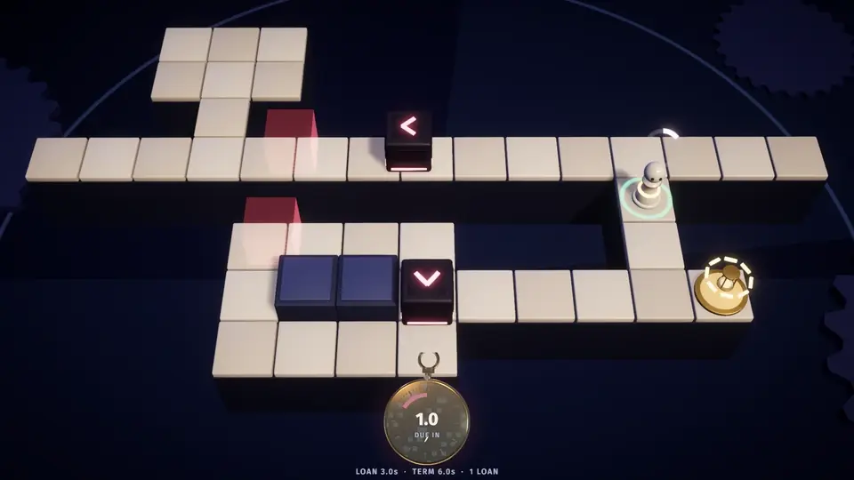
</p>

<h1 align="center">Borrowed Seconds</h1>

<p align="center"><b>Solve compact puzzles by borrowing time from your future self.</b></p>

<p align="center">
  
  
  
  
  
</p>

<p align="center">
  <a href="https://github.com/nearbycoder/BorrowedSeconds/releases/latest"><b>Download for Linux</b></a> ·
  <a href="docs/media/trailer.mp4"><b>Watch the trailer</b></a> ·
  <a href="#how-to-play">How to play</a> ·
  <a href="#build-from-source">Build from source</a>
</p>

---

## Trailer

<a href="docs/media/trailer.mp4">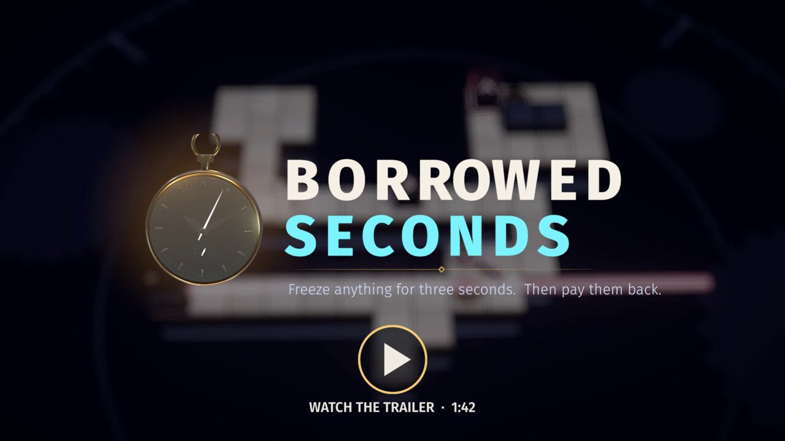</a>

A 1:36 feature trailer: scripted gameplay recorded frame by frame from the release build, with the game's own music and sound effects. It covers every mechanic, obstacle, device and system. Click the poster to open the MP4, or [download it directly](https://github.com/nearbycoder/BorrowedSeconds/raw/main/docs/media/trailer.mp4) (36 MB, 1080p60).

## About

Freeze any moving obstacle for three seconds. The catch is that the time is **borrowed**. A few seconds later the debt comes due and *you* freeze for three seconds, wherever you happen to be standing.

While you're frozen, nothing can hurt you. Sliders, laser beams and rotor arms pass straight through. But if you thaw inside a hazard, you **default** and time rewinds. The best solutions turn the debt into the plan: you pay it back standing on a gold dial, or exactly as a laser sweeps over you.

Every level is a single screen, the rules are fully deterministic, and an exhaustive solver has proven every one of the 35 levels solvable. Where a level is built around a trick, the solver also proves the trick is required.

## How to play

| Action | Keyboard + mouse | Gamepad |
|---|---|---|
| Move (one tile per step; hold to keep walking) | WASD / arrow keys | Left stick / D-pad |
| Aim at an obstacle | Hover it with the mouse, or cycle with Tab / Q / E | LB / RB |
| **Borrow** (freeze the aimed obstacle for 3 s) | Left click or Space | A |
| **Focus** (time runs at 20 % while you line up a shot) | Hold Shift or right mouse button (or tap to toggle; see Settings) | Hold LT (or tap to toggle) |
| **Rewind** | Hold Z or Backspace | Hold X |
| Restart the level (tap in the first 3 s, then hold for 0.6 s) | R | Y |
| Show or fold the level's hint | H | Select / View |
| Pause | Esc / P | Start |

Every keyboard action (movement, Borrow, Focus, Rewind, Restart, Hint, aiming and Pause) can be rebound in **Settings > Controls**. The arrow keys, Esc, Enter, Tab and Backspace always keep their meaning, so the game can't be locked out. Menus work with keyboard, mouse or gamepad, and on-screen key hints switch to match the device you last used and the keys you've bound. The table names Xbox buttons; with a PlayStation (DualShock 4, DualSense) or Switch Pro controller, the hints, tips and menu footers use that controller's names instead (Cross, Circle, L1, L2, Options…). Unplugging the controller mid-level pauses the game. There are no touch controls.

**The rules in one breath:** the world ticks at a fixed 20 Hz. You can have one loan out at a time. The loan freezes an obstacle for 3.0 s, and its **term** (usually 5 s, between 3 and 8 s depending on the level) counts down on the pocket watch. When the term runs out you freeze for 3.0 s. The ghost preview shows where every hazard will be when you thaw, and whether the spot you're standing on is safe. Some levels cap how many loans you can take; the pips under the watch count what's left.

## Features

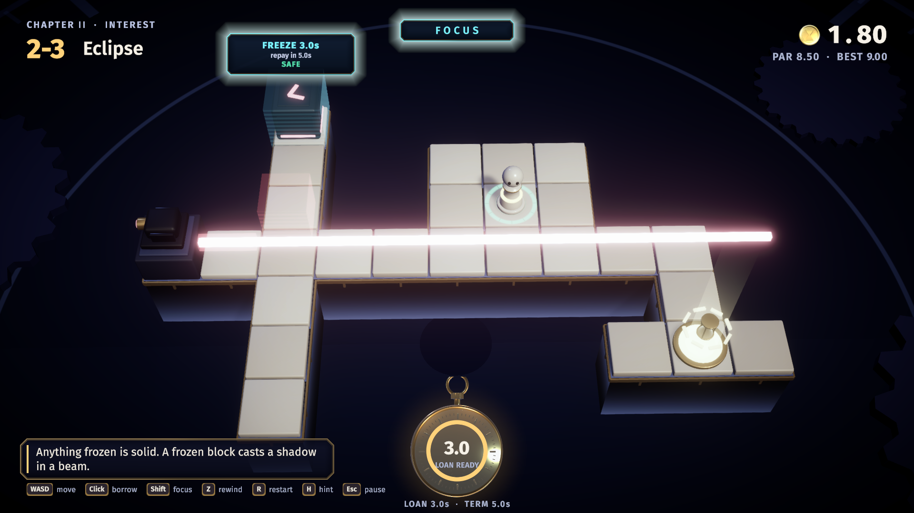 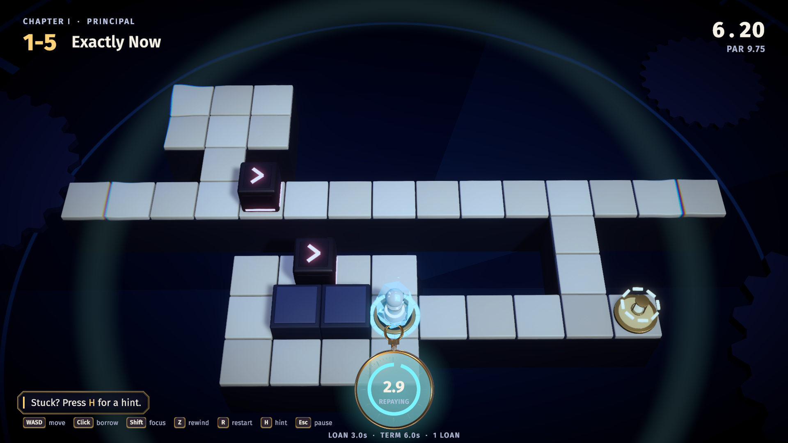

- **One verb, two sides.** Borrowing freezes a sliding block, a laser or a rotor into crystal for three seconds. Repaying freezes you. Both halves are useful: a frozen obstacle is a wall, and a frozen you is untouchable.
- **Truthful ghosts.** Aim at something and red ghosts forecast every hazard at the moment you'd thaw, along with a safe or lethal ring under your feet. They're computed by running the real simulation forward, so they're never wrong. The verdict never rests on colour alone: a lethal ring carries a dark X, the aim tag says *SAFE* or *LETHAL*, and while a debt runs the line under the watch reads *THAW HERE: …* for the tile you're on.
- **Focus and rewind.** Hold Focus to slow time to a crawl while you aim. Hold rewind to scrub back through everything that happened. Defaulting rewinds you automatically: two seconds back, or further if you'd otherwise land inside the freeze you just thawed out of, so you always get control back with at least a second to spare.
- **Three obstacles, each with a frozen form.** *Sliders* shuttle along tracks and bounce off anything solid. *Lasers* blink on a cycle and flicker before firing; freeze one while it's lit and it leaves a crystal bar that blocks other beams. *Rotors* sweep their arms in quarter turns; a frozen arm is a wall.
- **Devices that care about weight.** *Plates* hold a gate open while anything rests on them, including a block you froze there. Each plate wears a colour and a number of dots, and so does every gate it holds and every laser it darkens. Pressing a plate sends a pulse of light to each of them, so the wiring reads at a glance, even without colour. *Gold dials* latch after three seconds of continuous weight from you (frozen or not) or from a frozen block. The exit opens once every dial is latched.
- **Crystal physics.** In the later chapters, a frozen block pens another slider in, rotor arms swing back off crystal, a frozen arm shades a laser, one crystal bar pens two sliders at once, and a gate you shut stops light.
- **Help when you're stuck, only if you ask.** Levels whose tip would give the trick away keep it folded until you press H. After a few defaults, the tip points you to *Watch solution* in the pause menu. It plays the solver's own route at par, aiming each borrow just before it happens so you can see what gets frozen and the forecast. Hold Focus to slow the replay and Rewind to see a moment again. Then it hands the level back fresh; watching records no time and unlocks nothing. The Ledger keeps those folded tips folded too, until you've settled the level.
- **Medals against a proven par.** Par is the solver's optimal time. Finish within par + 1 s for gold (*Time Thief*), within par + 4 s for silver, or anywhere for bronze.
- **Teaches without text walls.** Keycap prompts float in the world over the thing they mean, such as *Hover + click, freeze it* over the nearest slider, then retire for good once you've done it. Each level adds one idea, along with a one-line tip.
- **Juice everywhere.** Hit-stop on every borrow, a full-screen time-ripple with chromatic split, a rewind smear, screen shake, dial-latch flashes, a medal coin that drops and stamps, and clock-hand wipes between screens.
- **Pauses when you look away.** If the window loses focus mid-level, the pause menu opens, so the debt never falls due while you're in another window.
- **Comfort settings.** Master, music and effects volume, fullscreen, screen shake, reduced flashing, Focus strength, Focus as a toggle instead of a hold, and a **game speed** assist (100, 85, 70 or 50 %) that slows the whole level in real time. Times and medals count game ticks, so they mean the same at any speed; the HUD shows the speed when it isn't 100 %. Progress and settings save automatically.

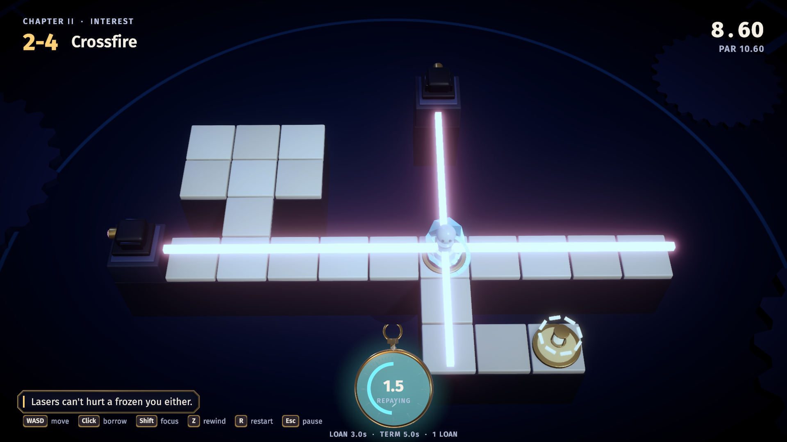 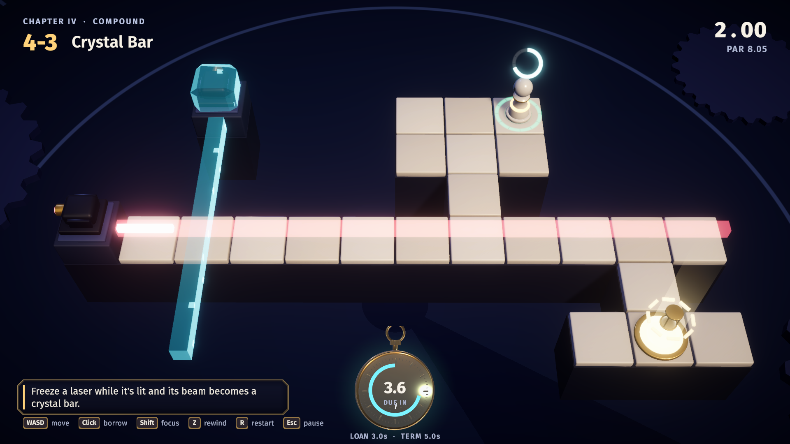

## Content

Thirty-five single-screen levels in seven chapters. Each chapter opens with a title card, and each level unlocks when the previous one is settled. The Ledger tracks medals and best times for each level.

| Chapter | Introduces | Levels |
|---|---|---|
| I · Principal | Borrowing, the debt and sliders | First Loan, Pass-Through, Grace Period, Collateral, Exactly Now |
| II · Interest | Lasers, plates and gates | Blink, Counterweight, Eclipse, Crossfire, Fine Print |
| III · Momentum | Rotors | Turnstile, Clockwork, Second Hand, Gnomon, Escapement |
| IV · Compound | Everything at once, short and long terms, loan caps | Double Entry, Refinance, Crystal Bar, Long Term, Settlement |
| V · Leverage | Crystal pushing back: pens, rebounds, backswings | Rebound, Backswing, Crossbar, Pendulum, Fulcrum |
| VI · Escrow | Leaving things behind to hold doors | Lockout, Gatekeeper, Doorstop, Two Keys, Escrow |
| VII · Overdraft | Short terms: 1.5 to 2.5 s between loan and debt | Short Notice, Float, Same Day, Cutoff, Payroll |

Eighteen levels are proven to need *the debt itself*. Even with unlimited debt-free loans they can't be solved, so your own freeze has to be part of the solution. Every level also has a timing margin of at least ±150 ms around its intended solution.

<details>
<summary><b>Every level, and what the solver proves about it</b> (mild spoilers)</summary>

| # | Name | Obstacles and devices | Proven |
|---|---|---|---|
| 1-1 | First Loan | slider | B |
| 1-2 | Pass-Through | slider | B, D |
| 1-3 | Grace Period | 2 sliders (3 s term) | B, needs ≥ 2 loans |
| 1-4 | Collateral | 2 sliders, 2 dials | B |
| 1-5 | Exactly Now | 2 sliders, dial (6 s term) | B, D |
| 2-1 | Blink | 4 lasers | B |
| 2-2 | Counterweight | slider, laser, plate + gate | B |
| 2-3 | Eclipse | slider, laser | B |
| 2-4 | Crossfire | 2 lasers, dial | B, D |
| 2-5 | Fine Print | slider, laser, plate + gate, dial (3 s term) | B, D |
| 3-1 | Turnstile | rotor | B |
| 3-2 | Clockwork | 2 rotors, dial | B, D |
| 3-3 | Second Hand | 2 rotors, dial (6 s term) | B, D |
| 3-4 | Gnomon | rotor, laser | B |
| 3-5 | Escapement | 2 rotors, 2 lasers, dial (7 s term) | B, D |
| 4-1 | Double Entry | slider, laser, 2 dials | B, D |
| 4-2 | Refinance | 3 lasers (3 s term) | B, needs ≥ 3 loans |
| 4-3 | Crystal Bar | 2 lasers | B |
| 4-4 | Long Term | 2 sliders, laser, dial (8 s term) | B, D |
| 4-5 | Settlement | 2 sliders, laser, rotor, 2 dials | B, D |
| 5-1 | Rebound | 2 sliders (a frozen block pens the other) | B |
| 5-2 | Backswing | slider, rotor (the arm swings back off crystal) | B |
| 5-3 | Crossbar | 2 sliders, laser (one crystal bar pens both) | B |
| 5-4 | Pendulum | slider, laser, rotor (a frozen arm shades and walls) | B |
| 5-5 | Fulcrum | 2 sliders, dial | B, D |
| 6-1 | Lockout | slider, laser, plate + gate (shut a block in a pen) | B |
| 6-2 | Gatekeeper | looping slider, laser, plates + gate (a shut gate stops light) | B |
| 6-3 | Doorstop | 2 sliders, plates + gate, dial | B, D |
| 6-4 | Two Keys | 2 sliders, 2 plates + 2 gates, dial | B |
| 6-5 | Escrow | 2 sliders, plate + gate, dial | B, D |
| 7-1 | Short Notice | slider, 2 dials (1.5 s term) | B, D |
| 7-2 | Float | 2 sliders, laser, dial (2.5 s term) | B, D |
| 7-3 | Same Day | laser, 2 dials, 2 loans (2 s term) | B, D |
| 7-4 | Cutoff | 2 sliders, 2 lasers, dial (2.5 s term) | B, D |
| 7-5 | Payroll | laser, 3 dials, 3 loans (2 s term) | B, D |

*B*: unsolvable without borrowing. *D*: unsolvable even with unlimited debt-free loans, so your own freeze has to be part of the solution. Every level keeps a timing margin of at least ±3 ticks (150 ms); all but 2-4 have ±4.

</details>

## Screenshots

| | |
|---|---|
| 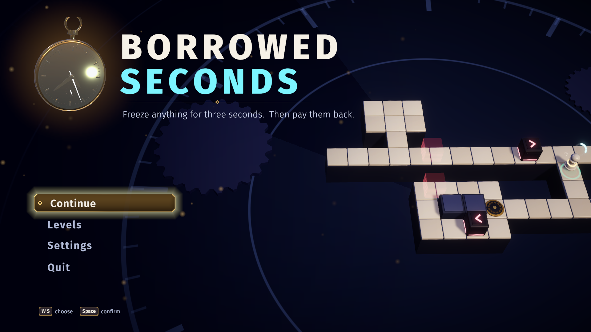 | 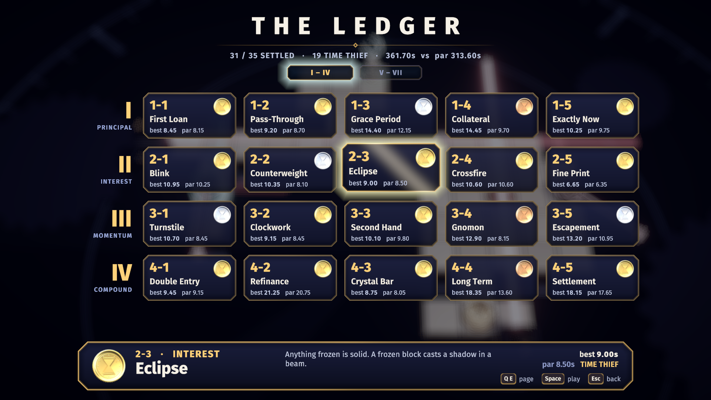 |
| 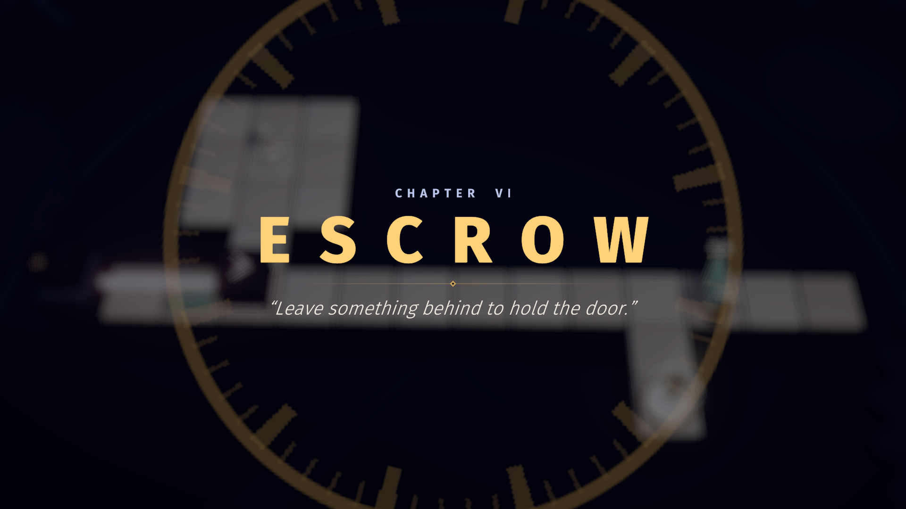 | 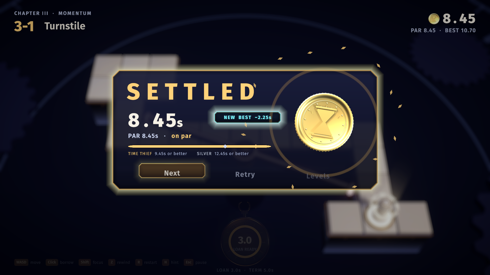 |
| 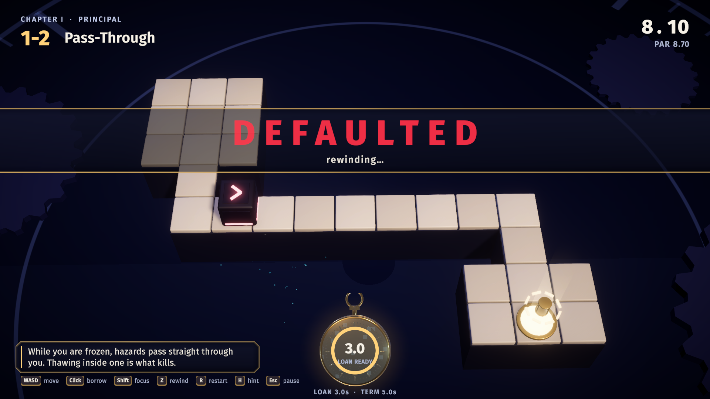 | 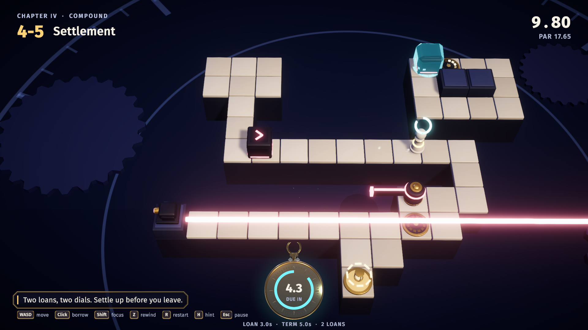 |
| 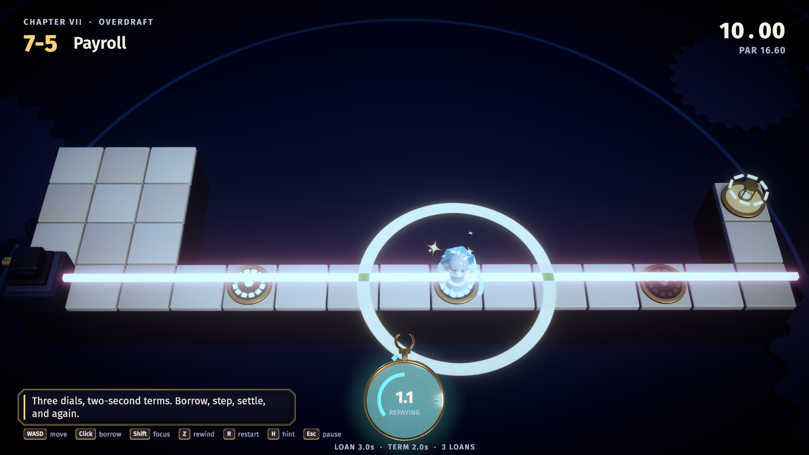 | |

## Play it

1. Download `BorrowedSeconds-v0.1.0-linux-x86_64.zip` from the [latest release](https://github.com/nearbycoder/BorrowedSeconds/releases/latest).
2. Unzip it and run `./BorrowedSeconds.x86_64`. If the file manager lost the executable bit, run `chmod +x BorrowedSeconds.x86_64` first.

Requirements: 64-bit Linux and an OpenGL 4.5-capable GPU. The game starts fullscreen; you can switch to windowed in Settings. On Wayland desktops where XWayland is unreliable, add `-force-wayland` to use Unity's native Wayland backend. This build has only been tested on Linux (CachyOS, AMD iGPU).

There's no published macOS or Windows build yet. You can make a macOS app yourself with `Tools/unity.sh build-mac` (see below), but it has never been run on a Mac.

## Build from source

You need **Unity 6000.6.2f1** (Universal Render Pipeline) to build the game. **Blender 4.5** is only needed to regenerate the models and audio, and **ffmpeg** and **ImageMagick** only for the trailer.

```sh
git clone https://github.com/nearbycoder/BorrowedSeconds.git
cd BorrowedSeconds
Tools/unity.sh build-linux        # batch build -> Builds/Linux/BorrowedSeconds.x86_64
Tools/unity.sh build-mac          # macOS, universal (Intel + Apple silicon) -> Builds/macOS/BorrowedSeconds.app
Tools/play.sh                     # run it windowed at 1600x900
```

Or open the folder in Unity Hub and press Play in `Assets/Scenes/Main.unity`. The scene only holds a camera, a light and a volume; everything else is built at runtime from data.

Everything generated is checked in, so none of the following is needed just to build:

| What | Command | Notes |
|---|---|---|
| 3D models | `blender -b --factory-startup -P ArtSource/build_assets.py` | Writes `Assets/Resources/Models/*.fbx`, `ArtSource/*.blend` and preview renders. |
| UI models | `blender -b --factory-startup -P ArtSource/build_ui_assets.py` | The 3D pocket watch, the medal coins and the padlock. |
| Audio | `Tools/audio/synth.sh` (or `sfx`, `music`, or one name) | Every effect and the four music loops, synthesised with numpy (via Blender's bundled Python). About 2 minutes. |
| Levels | Edit `Tools/lab/cXY.json`, then `python3 Tools/lab/assemble.py` | `python3 Tools/lab/lab.py Tools/lab/c15.json` solves one design without touching the game. |
| Proofs and replays | `Tools/validate.sh` (or `--level 4-5`, or `--quick`) | Proves every level and writes `solutions.json`. Level 4-5 searches up to 150M states and needs a lot of RAM. |
| Unit tests | `Tools/test.sh`, or the Test Runner | 109 EditMode tests, run in a batch editor whose config folder is a sandbox under `Builds/tests/`, so the runner's copy of its results never lands in your own `~/.config/unity3d`. They replay every saved solution under Unity's Mono runtime and check that each one wins at exactly its par tick, and check that the automatic rewind after a death always hands control back. |
| Self-test | `Tools/devcap.sh Builds/capture` | Development build, then autoplays all 35 levels and prints PASS/FAIL for each. |
| Controls test | `Tools/inputbot.sh` | Plays 1-1 through virtual keyboard and mouse devices, then again on a virtual gamepad (D-pad, stick, RB aim, LT focus, A borrow), and drives the hint toggle, pause menu and *Watch solution* with the pad (including slowing and rewinding the replay). Also checks rebinding, hold-to-restart, the Focus toggle, button names on virtual DualSense, DualShock 4 and Switch Pro controllers, and that unplugging the pad pauses. |
| Screen shapes | `Tools/shapes.sh [dir] [dev] [WxH…]` | Runs the menu tour and one level (`BS_LEVEL`, default 4-5) in windows of 2560×1080, 1600×900, 1280×800 and 1024×768, and makes a contact sheet for each. |
| Behaviour checks | `Tools/checks.sh [dir] [dev] [-bsOnly name]` | The built game dies, rewinds and opens menus on purpose, and prints PASS/FAIL for each check. It also records an audio event log over three levels, and `Tools/audio/balance.py` measures how far each key stinger sits above the music. |
| Docs check | `python3 Tools/docs_check.py` | Cross-checks every level the README and `docs/PLAN.md` name (titles, chapters, proof claims, par, margin, counts) against `levels.json` and `solutions.json`. |
| Scripted runs | `BS_SIZE=2560x1080 Tools/play.sh …` | Every scripted tool (capture, checks, input bot, trailer and demo recorders) keeps Unity's config, including the screen-size prefs Unity writes on quit, in its own output folder, never in `~/.config/unity3d`. So do `Tools/unity.sh`'s batch builds: the editor shares the game's save file and rewrote it on every build. `BS_SIZE` picks another window size.|
| Release zip | `Tools/package.sh 0.1.0 [linux\|macos]` | Zips the Linux or macOS build with a short README and the font licenses into `Builds/Release/`. The macOS README explains how to open an unnotarized app. |
| Trailer and media | `Tools/trailer/make_trailer.sh` | Records the scripted trailer from the release build, then cuts, scores and encodes it. See [Tools/trailer/README.md](Tools/trailer/README.md). |

## Project structure

```
Assets/
  Scripts/Sim/      Pure C# rules (no UnityEngine): levels, state, Simulation.Step, the BFS solver
  Scripts/Game/     Flow and level session (20 Hz loop, focus, rewind history), input, save,
                    scripted runs: autopilot, demo reel, input bot, trailer (GameRoot.*.cs)
  Scripts/View/     Board, pieces, ghost preview, camera rig, particles, backdrop and post FX
  Scripts/UI/       Runtime-built uGUI + TextMeshPro: HUD, menus, prompts, UI kit, text effects
  Scripts/Audio/    Pooled one-shots with a "frozen" low-pass, crossfading music decks
  Shaders/          Crystal, ghost, beams, backdrop, time ripple, UI panel, clock wipe
  Resources/        levels.json + solutions.json, models, audio, fonts, UI renders
  Tests/Editor/     EditMode replay tests
ArtSource/          Blender generator scripts, the .blend files they write, preview renders
Tools/              unity.sh, play.sh, validate.sh, capture.sh, inputbot.sh, package.sh
  Solver/           .NET 8 console front end for the shared rules and solver
  lab/              Level design files, sweeps and the assembler
  audio/            synth.py: every sound and music loop
  demo/, trailer/   Frame-locked recorders and offline soundtrack mixers
docs/               PLAN.md (design and technical plan), BRIEF.md (the original brief), media/
```

## Tech highlights

- **One deterministic simulation everywhere.** `Simulation.Step` advances exactly one 20 Hz tick using only integers, with no allocation and no unordered iteration. The game, the ghost previews, the console solver and the unit tests all compile the same files, and the tests check that .NET 8 and Unity's Mono agree tick for tick.
- **An exhaustive solver that proves things.** A breadth-first search over packed 256-bit states at the player's decision points (with a compact open-addressing node store, about half the memory per state). It finds the optimal par, then re-runs the search under relaxed rules to prove a level is unsolvable *without borrowing* or *with the debt forgiven*. It also measures how many ticks of timing slack the solution has.
- **Ghosts by simulation.** The preview clones the current state and steps it forward to the moment you'd thaw, assuming you borrow now and stand still. Because a frozen player never blocks anything, that forecast doesn't depend on your later moves.
- **Instant rewind.** Every tick's state is kept in a pooled history, so rewinding is just scrubbing it backwards with an accelerating speed curve. The render interpolates between neighbouring ticks.
- **No stock assets.** Every model is generated by Blender `bpy` scripts. Every sound effect and music loop is synthesised with numpy: four 16-bar loops at 96 BPM, with their reverb tails wrapped so they loop seamlessly. Every UI panel is one procedural shader (chamfered brass rim, enamel gradient, glow, sheen, clock-hand reveal).
- **A trailer recorded by the game.** The trailer is a shot list played by the release build, with replays driving the levels and captions drawn by the game's own UI kit. Each shot is captured frame-locked at 60 fps, and the soundtrack is rebuilt offline from the game's audio event log, so every cut and caption is reproducible.

## Credits and tooling

Design, code, levels, models (Blender `bpy`), sound and music (numpy synthesis) were all made for this project by AI coding-agent sessions working from [the design brief](docs/BRIEF.md). Text is set in **Fira Sans** (SIL Open Font License), with TextMesh Pro's Liberation Sans as the fallback. Third-party components and their licenses are listed in [THIRD_PARTY_NOTICES.md](THIRD_PARTY_NOTICES.md).

Built with Unity 6 (URP, Input System, TextMesh Pro), Blender 4.5, Python with numpy, .NET 8, ffmpeg and ImageMagick.

## Status and known issues

Version 0.1.0. The game is complete and playable from start to finish, but it's young. Here's what is and isn't verified:

- ✅ The release build autoplays all 35 levels from the solver's replays and wins every one (`Tools/capture.sh`), so the in-game loop matches the solver tick for tick.
- ✅ The solver proves every level solvable and proves each "needs a borrow" and "needs the debt" claim. 109 EditMode tests pass.
- ✅ `Tools/checks.sh` passes on the release build. The game dies by thawing inside a hazard and gets control back, pauses on a (simulated) focus loss, folds and unfolds hints, keeps spoiler tips folded in the Ledger, wires plates to gates and lasers, slows to 70 % game speed, enforces the key-binding rules, opens every chapter on its card, and plays *Watch solution* at par on all 35 levels, with every borrow aimed before it fires, without touching progress. It also records the audio mix for `balance.py`, and checks that the thaw forecast is spelled out in words on every frame of three scripted runs. The autopilot also wins every level at its exact par tick at 50 % game speed.
- ✅ The input bot wins 1-1 through the real input path four ways: keyboard and mouse, a virtual gamepad (which also drives the hint, the pause menu and *Watch solution*), keys rebound through *Settings > Controls*, and a hold-to-restart check. A fifth pass turns on *Toggle Focus* and checks that a tap of Shift, the right mouse button or LT keeps time slowed until the next tap. A sixth reads every on-screen button name with a virtual DualSense, DualShock 4, Switch Pro controller and plain gamepad, then unplugs the pad mid-level and checks the game pauses. The gamepad pass also holds LT and X during *Watch solution*: the replay slows, goes back, and still wins at par. On the development machine (AMD Radeon 8060S iGPU, 1600×900), the busiest levels run at 300+ fps.
- ⚠️ **Some new paths were verified by script, not by hand.** No real window was alt-tabbed to test the focus-loss pause; the check calls the same handler. Gamepad play, including the hint (Select), the pause menu and leaving *Watch solution* (B), is verified on a *virtual* gamepad by the input bot, but not on real controller hardware. The same goes for PlayStation and Switch button names: on Linux, Unity recognises a PlayStation controller by reading it as a HID device, and its docs note that some distributions restrict that (hidraw) access for the DualSense. Without it, Unity reports a plain gamepad and the hints use Xbox names.
- ✅ **Other screen shapes.** The interface scales so it never has less than 1920×1080 units of room, and the camera slides or pulls back until no floor tile sits under the HUD or the pocket watch. `Tools/shapes.sh` checks the menus and a level at 21:9, 16:9, 16:10 and 4:3, but only in windows on one 4K monitor, not on real ultrawide, 4:3 or Steam Deck screens.
- ⚠️ **Colour-blind play is checked by simulation.** The thaw forecast now reads in words and shapes as well as colour, which was checked through a deuteranopia colour matrix and in greyscale, not by colour-blind players.
- ⚠️ **Not playtested by humans yet.** Difficulty and timing margins come from the solver, not from people. Some levels may be harder than they look.
- ⚠️ **The audio mix hasn't been tuned by ear.** It is balanced by measurement instead. The music now ducks under the key stingers (borrow, freeze, thaw, latch, exit, win, default), stinger pile-ups are trimmed, and the music sits 2 dB lower. On the same scripted run, `balance.py` measures every key stinger at least +5 dB over the music (median +10.1 to +11.0 dB across runs; before: median +3.5 dB, with borrow 1 dB *under* the music), and the mix peaks at 0.84 to 0.89 instead of 0.97. Nobody has listened to it yet.
- ⚠️ **Released for Linux only.** `Tools/unity.sh build-mac` builds a universal macOS app (Intel and Apple silicon, Mono, bundle id `com.nearbycoder.borrowedseconds`). Unity ad-hoc signs it, but it isn't Developer-ID signed or notarized, and it has never been run on a Mac, so it isn't published. Windows needs Unity's Windows Build Support module, which isn't installed on the build machine; `Tools/unity.sh build-windows` is ready for it but untested. There's no web build.
- ⚠️ **Work in progress beyond chapter VII.** Chapters VIII–XII (a 60-level total) are named in `LevelCatalog.cs` (*Amortize*, *Exposure*, *Maturity*, *Arbitrage*, *Solvency*) but not shipped; a chapter ships only when all five of its levels are proven. Three chapter VIII designs sit in `Tools/lab/` (`c81`, `c82`, `c85`: *Shade*, *Bridge*, *Joint Account*), each proven to need at least two loans, and *Joint Account* to need the debt as well. Round 3's sweeps found no fourth or fifth design with an idea of its own (see `docs/IMPROVEMENTS.md`). The earlier lab design *Instalments* was dropped because its map duplicated 7-3 *Same Day*. Chapter VII's five levels are solver-proven but, like the rest, have never been played by a person; two of them (7-2, 7-4) came out of an automated sweep and share an idea (freeze the lane's beam, let the debt hold the dial).
- ⚠️ **The trailer predates chapter VII** and rounds 1–2's interface changes (it says 30 levels and six chapters). Re-cutting it is the owner's call. The README screenshots come from the current build (`Tools/trailer/make_trailer.sh --stills`) and, since round 5, use the game's own framing, which keeps every floor tile out from under the HUD. The trailer's shots keep their older framing so the cut stays reproducible; in the trailer, 4-5's bottom dial still sits under the watch.
- ⚠️ **No license has been chosen yet.** All rights are reserved until a `LICENSE` file is added.
