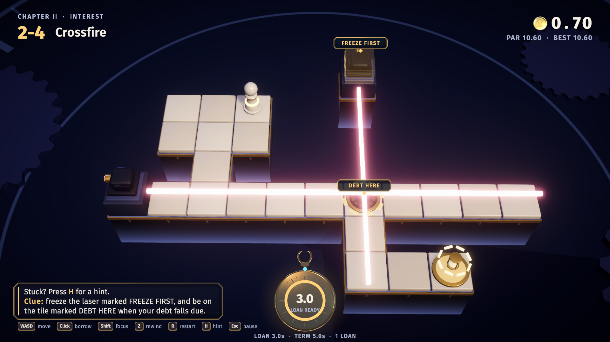
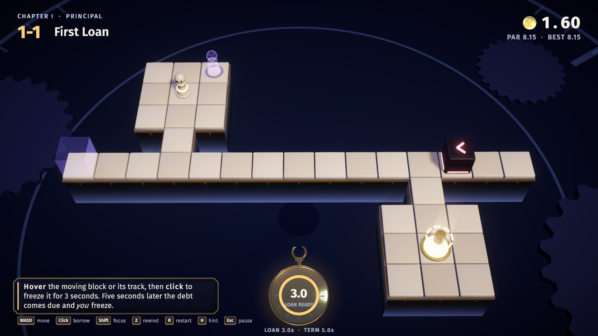
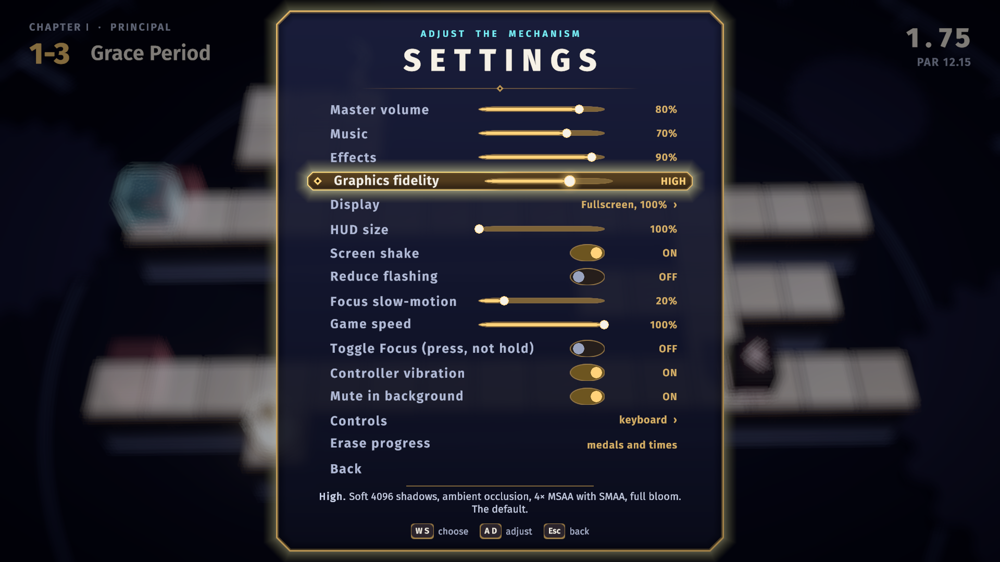

<p align="center">
  
</p>

<h1 align="center">Borrowed Seconds</h1>

<p align="center"><b>Solve compact puzzles by borrowing time from your future self.</b></p>

<p align="center"><a href="https://nearbycoder.github.io/BorrowedSeconds/"><b>▶ Play in your browser</b></a> (an 18 MB download; <a href="#in-your-browser">notes</a>)</p>

<p align="center">
  
  
  
  
  
</p>

<p align="center">
  <a href="docs/media/trailer.mp4"><b>Watch the trailer</b></a> ·
  <a href="#how-to-play">How to play</a> ·
  <a href="#play-it">Play it</a> ·
  <a href="#build-from-source">Build from source</a>
</p>

---

Freeze any moving obstacle for three seconds. The catch is that the time is **borrowed**. A few seconds later the debt comes due and *you* freeze for three seconds, wherever you happen to be standing.

While you're frozen, nothing can hurt you. Sliders, laser beams and rotor arms pass straight through. But if you thaw inside a hazard, you **default** and time rewinds. The best solutions turn the debt into the plan: you pay it back standing on a gold dial, or exactly as a laser sweeps over you.

Every level is a single screen, the rules are fully deterministic, and an exhaustive solver has proven every one of the 35 levels solvable. Where a level is built around a trick, the solver also proves the trick is required.

## Trailer

<a href="docs/media/trailer.mp4"></a>

A 1:42 trailer of today's game: scripted gameplay recorded frame by frame from the release build at Graphics fidelity *Ultra*, with the game's own music and sound effects and no narration. It shows borrowing and the debt, every obstacle and device, the thaw forecast, the clue, the best-run ghost, the Low-to-Ultra graphics steps, Settings and chapter VII. Click the poster to open the MP4, or [download it directly](https://github.com/nearbycoder/BorrowedSeconds/raw/main/docs/media/trailer.mp4) (36 MB, 1080p60).

## How to play

| Action | Keyboard + mouse | Gamepad |
|---|---|---|
| Move (one tile per step; hold to keep walking) | WASD / arrow keys | Left stick / D-pad |
| Aim at an obstacle | Hover it with the mouse (or the ground it owns: a block's track, a laser's lane, a rotor's sweep), or cycle with the mouse wheel or Tab / Q / E | LB / RB |
| **Borrow** (freeze the aimed obstacle for 3 s) | Left click or Space | A |
| **Focus** (time runs at 20 % while you line up a shot) | Hold Shift or right mouse button (or tap to toggle; see Settings) | Hold LT (or tap to toggle) |
| **Rewind** | Hold Z or Backspace | Hold X |
| Restart the level (tap in the first 3 s, then hold for 0.6 s) | R | Y |
| Show or fold the level's hint | H | Select / View |
| Pause | Esc / P | Start |

**The rules in one breath:** the world ticks at a fixed 20 Hz, starting the moment you first move, borrow or focus: until then the level waits at 0.00, so you can read the board and aim (to see the forecast) before anything moves. You can have one loan out at a time. The loan freezes an obstacle for 3.0 s, and its **term** (usually 5 s, between 1.5 and 8 s depending on the level) counts down on the pocket watch. When the term runs out you freeze for 3.0 s. The ghost preview shows where every hazard will be when you thaw, and whether the spot you're standing on is safe. Some levels cap how many loans you can take; the pips under the watch count what's left.

Every keyboard action can be rebound in **Settings > Controls**; the arrow keys, Esc, Enter, Tab and Backspace always keep their meaning, so the game can't be locked out. Menus work with keyboard, mouse or gamepad, and the on-screen key hints follow the device you last used and the keys you've bound. The table names Xbox buttons; with a PlayStation (DualShock 4, DualSense) or Switch Pro controller, the hints, tips and menu footers use that controller's names (Cross, Circle, L1, L2, Options…). Unplugging the controller mid-level pauses the game. There are no touch controls. *How to play*, in the title and pause menus, recaps the rules with your own bindings.

## Features

 

### The puzzle

- **One verb, two sides.** Borrowing freezes a sliding block, a laser or a rotor into crystal for three seconds. Repaying freezes you. A frozen obstacle is a wall, and a frozen you is untouchable.
- **Truthful ghosts.** Aim at something and red ghosts forecast every hazard at the moment you'd thaw, with a safe or lethal ring under your feet. They come from running the real simulation forward, so they're never wrong. The verdict never rests on colour alone: a lethal ring carries a dark X, the aim tag says *SAFE* or *LETHAL*, and while a debt runs the line under the watch reads *THAW HERE: …* for the tile you're on.
- **Focus and rewind.** Hold Focus to slow time while you aim; hold Rewind to scrub back through everything that happened. A default says what did it (*you thawed inside the beam*, *the block caught you*), marks that obstacle in red, and rewinds you far enough to get control back with at least a second to spare.
- **Three obstacles, each with a frozen form.** *Sliders* shuttle along tracks and bounce off anything solid. *Lasers* blink on a cycle and flicker before firing; freeze one while it's lit and it leaves a crystal bar that blocks other beams. *Rotors* sweep their arms in quarter turns; a frozen arm is a wall.
- **Devices that care about weight.** *Plates* hold a gate open while anything rests on them, including a block you froze there; each plate, and every gate and laser it controls, wears the same colour and number of dots, so the wiring reads without colour too. *Gold dials* latch after three seconds of weight from you (frozen or not) or a frozen block, and the exit opens once every dial is latched. Stand on a sealed exit and a tag counts the dials still to go.
- **Crystal physics.** In the later chapters a frozen block pens another slider in, rotor arms swing back off crystal, a frozen arm shades a laser, one crystal bar pens two sliders at once, and a gate you shut stops light.

### Help, medals and your best run

- **Help only if you ask.** Levels whose tip would give the trick away keep it folded until you press H. *Show a clue* in the pause menu marks the obstacle the solver's route freezes first (*FREEZE FIRST*) and the tile to be on when its debt falls due (*DEBT HERE*), and moves on to the next loan (*FREEZE NEXT*) on levels that take several. *Watch solution* plays the solver's route at par, aiming each borrow just before it fires; Focus slows the replay and Rewind goes back. Watching records no time and unlocks nothing. After three defaults the tip points you to both.
- **Medals against a proven par.** Par is the solver's optimal time. Finish within par + 1 s for gold (*Time Thief*), within par + 4 s for silver, or anywhere for bronze. On a level you've settled, a medal coin by the clock flips to silver, then bronze, the moment the better medal slips away; the Ledger and the *Settled* screen name the time each medal needs, and a new best says by how much (*NEW BEST −0.40s*).
- **Race your best run.** On a settled level, a violet ghost replays your best run in step with the clock, with whatever it froze shown as violet crystal. The pause menu switches it off.
- **Teaches without text walls.** Keycap prompts float over the thing they mean (*Hover + click, freeze it* over the nearest slider) and retire once you've done it. Each level adds one idea and a one-line tip.

 

### Graphics fidelity

One row in *Settings* with four steps. *High* is the default and the game's original look; the others trade it for speed or add to it ([the same frame at each step](docs/media/improvements/round12/01_fidelity-steps_4-5.jpg)).

| Step | Shadows | Anti-aliasing | Ambient occlusion | Bloom | Extras |
|---|---|---|---|---|---|
| Low | hard, 1024 | FXAA | off | quarter size | half the particles |
| Medium | soft, 2048 | 2× MSAA + SMAA | half resolution | half size | ¾ of the particles |
| **High** (default) | soft, 4096 | 4× MSAA + SMAA | on | half size | |
| Ultra | soft, 8192 | 8× MSAA + SMAA | deeper and wider | half size | point lights from the glowing pieces (the pawn's core, the open exit, lit beams), 1.5× particles, a sharper pocket watch |

On the development machine's shared iGPU (Radeon 8060S), the median frame at 2560×1440 rose from 11.4 ms on Low to 15.0 ms on Ultra; at 1920×1080 High and Ultra were within noise of each other (12.9 and 12.5 ms). Other sessions were using the GPU at the time, so treat these as rough. *Render resolution* (*Settings > Display*) is a separate control.

### Settings and accessibility

Every row in *Settings* says what it does in a line under the list.

- **Sound:** master, music and effects volume; *Mute in background* (on by default) fades the game out while its window isn't in front, and the level pauses when the window loses focus.
- **Display** (its own page): fullscreen or a window from 1280×720 up to the largest size that fits, and a render resolution of 50 to 100 % for weaker GPUs (menus and text stay sharp).
- **HUD size** 100, 125 or 150 % for small screens; above 100 % the key hints take two rows, and the camera pulls back to keep the board clear.
- **Comfort:** screen shake on or off, *Reduce flashing*, Focus strength, Focus as a toggle instead of a hold, and controller vibration (short pulses for a borrow, the debt, a default, a latch and a win).
- **Game speed** 100, 85, 70 or 50 %. Times and medals count game ticks, so they mean the same at any speed; the HUD shows the speed when it isn't 100 %.
- **Controls:** rebind every keyboard action. **Erase progress** (press twice) starts the Ledger over and keeps your settings and keys. Progress and settings save automatically.

 

## Content

Thirty-five single-screen levels in seven chapters. Each chapter opens with a title card, and each level unlocks when the previous one is settled. The Ledger tracks medals and best times for each level.

| Chapter | Introduces | Levels |
|---|---|---|
| I · Principal | Borrowing, the debt and sliders | First Loan, Pass-Through, Grace Period, Collateral, Exactly Now |
| II · Interest | Lasers, plates and gates | Blink, Counterweight, Eclipse, Crossfire, Fine Print |
| III · Momentum | Rotors | Turnstile, Clockwork, Second Hand, Gnomon, Escapement |
| IV · Compound | Everything at once, short and long terms, loan caps | Double Entry, Refinance, Crystal Bar, Long Term, Settlement |
| V · Leverage | Crystal pushing back: pens, rebounds, backswings | Rebound, Backswing, Crossbar, Pendulum, Fulcrum |
| VI · Escrow | Leaving things behind to hold doors | Lockout, Gatekeeper, Doorstop, Two Keys, Escrow |
| VII · Overdraft | Short terms: 1.5 to 2.5 s between loan and debt | Short Notice, Float, Same Day, Cutoff, Payroll |

Eighteen levels are proven to need *the debt itself*. Even with unlimited debt-free loans they can't be solved, so your own freeze has to be part of the solution. Every level also has a timing margin of at least ±150 ms around its intended solution.

<details>
<summary><b>Every level, and what the solver proves about it</b> (mild spoilers)</summary>

| # | Name | Obstacles and devices | Proven |
|---|---|---|---|
| 1-1 | First Loan | slider | B |
| 1-2 | Pass-Through | slider | B, D |
| 1-3 | Grace Period | 2 sliders (3 s term) | B, needs ≥ 2 loans |
| 1-4 | Collateral | 2 sliders, 2 dials | B |
| 1-5 | Exactly Now | 2 sliders, dial (6 s term) | B, D |
| 2-1 | Blink | 4 lasers | B |
| 2-2 | Counterweight | slider, laser, plate + gate | B |
| 2-3 | Eclipse | slider, laser | B |
| 2-4 | Crossfire | 2 lasers, dial | B, D |
| 2-5 | Fine Print | slider, laser, plate + gate, dial (3 s term) | B, D |
| 3-1 | Turnstile | rotor | B |
| 3-2 | Clockwork | 2 rotors, dial | B, D |
| 3-3 | Second Hand | 2 rotors, dial (6 s term) | B, D |
| 3-4 | Gnomon | rotor, laser | B |
| 3-5 | Escapement | 2 rotors, 2 lasers, dial (7 s term) | B, D |
| 4-1 | Double Entry | slider, laser, 2 dials | B, D |
| 4-2 | Refinance | 3 lasers (3 s term) | B, needs ≥ 3 loans |
| 4-3 | Crystal Bar | 2 lasers | B |
| 4-4 | Long Term | 2 sliders, laser, dial (8 s term) | B, D |
| 4-5 | Settlement | 2 sliders, laser, rotor, 2 dials | B, D |
| 5-1 | Rebound | 2 sliders (a frozen block pens the other) | B |
| 5-2 | Backswing | slider, rotor (the arm swings back off crystal) | B |
| 5-3 | Crossbar | 2 sliders, laser (one crystal bar pens both) | B |
| 5-4 | Pendulum | slider, laser, rotor (a frozen arm shades and walls) | B |
| 5-5 | Fulcrum | 2 sliders, dial | B, D |
| 6-1 | Lockout | slider, laser, plate + gate (shut a block in a pen) | B |
| 6-2 | Gatekeeper | looping slider, laser, plates + gate (a shut gate stops light) | B |
| 6-3 | Doorstop | 2 sliders, plates + gate, dial | B, D |
| 6-4 | Two Keys | 2 sliders, 2 plates + 2 gates, dial | B |
| 6-5 | Escrow | 2 sliders, plate + gate, dial | B, D |
| 7-1 | Short Notice | slider, 2 dials (1.5 s term) | B, D |
| 7-2 | Float | 2 sliders, laser, dial (2.5 s term) | B, D |
| 7-3 | Same Day | laser, 2 dials, 2 loans (2 s term) | B, D |
| 7-4 | Cutoff | 2 sliders, 2 lasers, dial (2.5 s term) | B, D |
| 7-5 | Payroll | laser, 3 dials, 3 loans (2 s term) | B, D |

*B*: unsolvable without borrowing. *D*: unsolvable even with unlimited debt-free loans, so your own freeze has to be part of the solution. Every level keeps a timing margin of at least ±3 ticks (150 ms); all but 2-4 have ±4.

</details>

## Screenshots

Captured from the release build at the default Graphics fidelity (*High*), 1920×1080.

| | |
|---|---|
|  |  |
|  |  |
|  |  |
|  |  |

## Play it

> **The published release is older than this README.** [v0.1.0](https://github.com/nearbycoder/BorrowedSeconds/releases/tag/v0.1.0) (October 4, 2026) has 30 levels in six chapters and none of the later work: no chapter VII, Graphics fidelity, clue, *Watch solution*, best-run ghost, key rebinding, HUD size, game speed, Display page or `BorrowedSeconds.sh` launcher. To play the game this README describes, [play it in your browser](#in-your-browser) or [build it from source](#build-from-source).

To run the v0.1.0 release: download `BorrowedSeconds-v0.1.0-linux-x86_64.zip`, unzip it and run `./BorrowedSeconds/BorrowedSeconds.x86_64`, adding `-force-wayland` on a Wayland desktop (the default X11 path can hang at startup; see [known issues](#status-and-known-issues)). If the file manager lost the executable bit, run `chmod +x` on it first.

A zip built from today's source with `Tools/package.sh` adds `BorrowedSeconds.sh`, which picks Unity's native Wayland backend on a Wayland session (`BS_X11=1` uses X11 anyway), and `install-launcher.sh`, which adds the game with its icon to your applications menu (`--uninstall` removes it).

### In your browser

**[nearbycoder.github.io/BorrowedSeconds](https://nearbycoder.github.io/BorrowedSeconds/)** runs today's game, all 35 levels, in a desktop browser with WebGL 2. The first visit downloads about 18 MB (the browser keeps it for later visits). Progress and settings are saved in the browser's storage for that site, separately from a desktop install; clearing the site's data erases them. Keyboard, mouse and gamepads work as on the desktop. There are no touch controls, so phones and tablets aren't supported.

What's different from the desktop build:

- It starts in the page. *Settings > Display mode* switches between *Fullscreen* and *Browser window*; **Esc** also leaves fullscreen (the browser takes that key first). There are no window sizes and no *Quit*.
- *Graphics fidelity* starts at *Medium* instead of *High*; all four steps work. *Render resolution* scales up with a plain filter instead of FSR, which doesn't run on WebGL.
- Sound starts after your first click or key press, as browsers require. The low-pass muffle while you're frozen or focusing is missing: Unity's web audio has no filters.
- There's no controller vibration (the row is hidden), and pad button names come from the name the browser reports, which is less reliable than the desktop's.

It has been tested only in headless Chromium 151 and Firefox 157 on Linux (AMD Radeon 8060S), with `Tools/check-pages.mjs`: it loads to the title with no errors, sound starts after a click, a settings change survives a reload, and level 1-1 is won from the keyboard and stays saved. Safari, Windows and macOS browsers, and weaker GPUs haven't been tried.

**System requirements:** 64-bit Linux (x86_64) and a GPU with OpenGL 4.5. The game starts fullscreen. If it runs slowly, set *Graphics fidelity* to Medium or Low, or lower *Render resolution* in *Settings > Display*. It has only been run on one machine: CachyOS, KDE Plasma on Wayland, AMD Radeon 8060S iGPU. There's no published macOS or Windows build (see below).

## Build from source

You need **Unity 6000.6.2f1** (Universal Render Pipeline) to build the game. **Blender 4.5** is only needed to regenerate the models and audio, and **ffmpeg** and **ImageMagick** only for the trailer.

```sh
git clone https://github.com/nearbycoder/BorrowedSeconds.git
cd BorrowedSeconds
Tools/unity.sh build-linux        # batch build -> Builds/Linux/BorrowedSeconds.x86_64
Tools/play.sh                     # run it windowed at 1600x900
Tools/package.sh 0.1.0 linux      # optional: a release zip in Builds/Release/
```

For the browser version, `Tools/build-pages.sh` builds the site into `Builds/Pages` (WebGL, Brotli files the page decompresses itself, so it runs from any static host such as GitHub Pages), and `node Tools/check-pages.mjs --local --play` serves it under `/BorrowedSeconds/` and checks it in headless Chromium (`--browser firefox` for Firefox).

Or open the folder in Unity Hub and press Play in `Assets/Scenes/Main.unity`. The scene only holds a camera, a light and a volume; everything else is built at runtime from data. `Tools/unity.sh build-mac` builds a universal macOS app that has never been run on a Mac; `build-windows` needs Unity's Windows Build Support module.

Everything generated is checked in, so none of the following is needed just to build. Every scripted tool keeps Unity's config (and so the save file) in its own output folder, never in `~/.config/unity3d`, and opens its game window in a private headless KWin (`Tools/nested.sh`) when KWin is installed (`BS_NESTED=0` opts out).

| What | Command | Notes |
|---|---|---|
| Unit tests | `Tools/test.sh`, or the Test Runner | 421 EditMode tests in a batch editor with a sandboxed config folder. They replay every saved solution under Mono and check it wins at exactly par, and cover rewinds, mouse-aim zones, death blame, the clue steps, the exit's reasons, recorded runs, the Graphics fidelity steps and the board's trim. |
| Proofs and replays | `Tools/validate.sh` (or `--level 4-5`, or `--quick`) | Proves every level and writes `solutions.json`. Level 4-5 searches up to 150M states and needs a lot of RAM. |
| Self-test | `Tools/capture.sh [dir] [dev]` | The built game autoplays all 35 levels and prints PASS/FAIL for each. |
| Behaviour checks | `Tools/checks.sh [dir] [dev] [-bsOnly name]` | The built game dies, rewinds, opens menus, steps every setting and plays *Watch solution* on purpose, and prints PASS/FAIL for each check. It also records an audio event log that `Tools/audio/balance.py` measures. |
| Controls test | `Tools/inputbot.sh` | Wins 1-1 through virtual keyboard, mouse and gamepad devices, and checks rebinding, hold-to-restart, the Focus toggle, controller button names, vibration commands and unplugging the pad. |
| Screen shapes | `Tools/shapes.sh [dir] [dev] [WxH…]` | The menus and one level at 21:9, 16:9, 16:10 and 4:3, with a contact sheet for each. |
| Graphics fidelity | `Tools/fidelity.sh [dir] [dev]` | The same held frame at each step, then frame times at each step with vsync off. |
| Browser build | `Tools/build-pages.sh`, then `node Tools/check-pages.mjs --local --play` | Builds the GitHub Pages site into `Builds/Pages`. The check exits 0 only when the page reaches the title with no errors; `--play` adds sound after a click, settings across a reload and a keyboard win of 1-1. Give it a URL instead of `--local` to check the live site. |
| Docs check | `python3 Tools/docs_check.py` | Checks every level claim in this README and `docs/PLAN.md` against `levels.json` and `solutions.json`. |
| 3D models | `blender -b --factory-startup -P ArtSource/build_assets.py` | Writes `Assets/Resources/Models/*.fbx`, `ArtSource/*.blend` and preview renders. `build_ui_assets.py` makes the pocket watch, medal coins, padlock and icon. |
| Audio | `Tools/audio/synth.sh` (or `sfx`, `music`, or one name) | Every effect and the four music loops, synthesised with numpy (via Blender's bundled Python). |
| Levels | Edit `Tools/lab/cXY.json`, then `python3 Tools/lab/assemble.py` | `python3 Tools/lab/lab.py Tools/lab/c15.json` solves one design without touching the game. |
| Trailer and media | `Tools/trailer/make_trailer.sh` | Records the scripted trailer from the release build, then cuts, scores and encodes it, and re-takes the README screenshots. See [Tools/trailer/README.md](Tools/trailer/README.md). |

## Project structure

```
Assets/
  Scripts/Sim/      Pure C# rules (no UnityEngine): levels, state, Simulation.Step, the BFS solver
  Scripts/Game/     Flow and level session (20 Hz loop, focus, rewind history), input, save, settings,
                    scripted runs: autopilot, checks, input bot, fidelity, trailer (GameRoot.*.cs)
  Scripts/View/     Board, pieces, ghost preview, camera rig, particles, backdrop and post FX
  Scripts/UI/       Runtime-built uGUI + TextMeshPro: HUD, menus, prompts, UI kit, text effects
  Scripts/Audio/    Pooled one-shots with a "frozen" low-pass, crossfading music decks
  Shaders/          Crystal, ghost, beams, backdrop, time ripple, UI panel, clock wipe
  Resources/        levels.json + solutions.json, models, audio, fonts, UI renders
  Tests/Editor/     EditMode tests
ArtSource/          Blender generator scripts, the .blend files they write, preview renders
Tools/              unity.sh, play.sh, test.sh, validate.sh, capture.sh, checks.sh, inputbot.sh, nested.sh, package.sh,
                    build-pages.sh and check-pages.mjs (the browser version)
  Solver/           .NET 8 console front end for the shared rules and solver
  lab/              Level design files, sweeps and the assembler
  audio/            synth.py: every sound and music loop; balance.py: the mix measurement
  demo/, trailer/   Frame-locked recorders and offline soundtrack mixers
docs/               PLAN.md (design and technical plan), BRIEF.md (the original brief),
                    IMPROVEMENTS.md (the twelve improvement rounds), media/
```

## Tech highlights

- **One deterministic simulation everywhere.** `Simulation.Step` advances exactly one 20 Hz tick using only integers, with no allocation and no unordered iteration. The game, the ghost previews, the console solver and the unit tests all compile the same files, and the tests check that .NET 8 and Unity's Mono agree tick for tick.
- **An exhaustive solver that proves things.** A breadth-first search over packed 256-bit states at the player's decision points finds the optimal par, then re-runs under relaxed rules to prove a level is unsolvable *without borrowing* or *with the debt forgiven*, and measures the solution's timing slack. The clue and *Watch solution* come straight from its route.
- **Ghosts by simulation.** The preview clones the current state and steps it forward to the moment you'd thaw, assuming you borrow now and stand still. Because a frozen player never blocks anything, that forecast doesn't depend on your later moves.
- **Instant rewind.** Every tick's state is kept in a pooled history, so rewinding is just scrubbing it backwards. The render interpolates between neighbouring ticks.
- **No stock assets.** Every model is generated by Blender `bpy` scripts, and the board's brass trim and plinth are built in code from each level's tiles. Every sound effect and music loop is synthesised with numpy. Every UI panel is one procedural shader (chamfered brass rim, enamel gradient, glow, sheen, clock-hand reveal).
- **A trailer recorded by the game.** The trailer is a shot list played by the release build, with the solver's replays driving the levels and captions drawn by the game's own UI kit. Each shot is captured frame-locked at 60 fps, and the soundtrack is rebuilt offline from the game's audio event log, so every cut is reproducible.

## Status and known issues

The game is complete and playable from start to finish, but nobody outside development has played it yet. What has been checked, and how, is recorded round by round in [docs/IMPROVEMENTS.md](docs/IMPROVEMENTS.md). In short, at the end of round 12 on the release build: the autopilot won all 35 levels at exactly par, every `checks.sh` check and every input-bot pass passed, the solver re-checked sample levels (no level data changed that round), and `docs_check.py` was clean. On this README's branch, all 421 EditMode tests pass (`Tools/test.sh`).

- ⚠️ **The published release is out of date.** v0.1.0 predates every improvement round (see [Play it](#play-it)). Cutting a new release is the owner's call.
- ⚠️ **Not playtested by humans.** Difficulty and timing margins come from the solver. Newer additions (the start hold, the clue, the best-run ghost, the exit tag, the brass trim, Ultra's lights and the Settings help lines) are verified by script only.
- ⚠️ **Linux only, one machine.** Everything ran on CachyOS with KDE Plasma (Wayland) on an AMD Radeon 8060S iGPU. The macOS app is built but unsigned and never run on a Mac; Windows needs a Unity module that isn't installed. Graphics fidelity has not been tried on a weaker GPU.
- ⚠️ **The browser version is checked by script in two headless browsers only** (see [In your browser](#in-your-browser)). Nobody has played it in a normal browser window yet, and it has no touch controls.
- ⚠️ **Unity's X11 path hangs at startup on the development desktop** (KDE Plasma on Wayland, through XWayland). `BorrowedSeconds.sh` avoids it by starting the native Wayland backend; the v0.1.0 zip has no script, so add `-force-wayland`. How common the hang is elsewhere isn't known.
- ⚠️ **Fullscreen is softer on the Wayland backend at fractional scaling.** At 125 % the game renders fullscreen at the logical size and the compositor scales it up ([comparison](docs/media/improvements/round9/04_scaling-125.png)). Only 125 % was tried.
- ⚠️ **Controllers and rumble were tested on virtual devices.** PlayStation and Switch button names need hidraw access on Linux, which some distributions restrict; without it the hints use Xbox names. Nobody has felt the vibration pulses.
- ⚠️ **The audio mix is balanced by measurement, not by ear.** Key sounds sit at least +5 dB over the music in `balance.py`'s runs, and the mix's peak sits close to the check's 0.90 limit (one run in round 9 went over it).
- ⚠️ **Colour-blind play is checked by simulation** (a deuteranopia matrix and greyscale), not by colour-blind players.
- ⚠️ **Chapters VIII–XII aren't shipped.** They are named in `LevelCatalog.cs`, and three chapter VIII designs sit proven in `Tools/lab/` (`c81`, `c82`, `c85`), but a chapter ships only when all five of its levels are proven. Chapter VII's 7-2 and 7-4 share an idea.
- ⚠️ **No license has been chosen yet.** All rights are reserved until a `LICENSE` file is added.

## Credits and tooling

Design, code, levels, models (Blender `bpy`), sound and music (numpy synthesis) were all made for this project by AI coding-agent sessions working from [the design brief](docs/BRIEF.md). Text is set in **Fira Sans** (SIL Open Font License), with TextMesh Pro's Liberation Sans as the fallback. Third-party components and their licenses are listed in [THIRD_PARTY_NOTICES.md](THIRD_PARTY_NOTICES.md).

Built with Unity 6 (URP, Input System, TextMesh Pro), Blender 4.5, Python with numpy, .NET 8, ffmpeg and ImageMagick.
