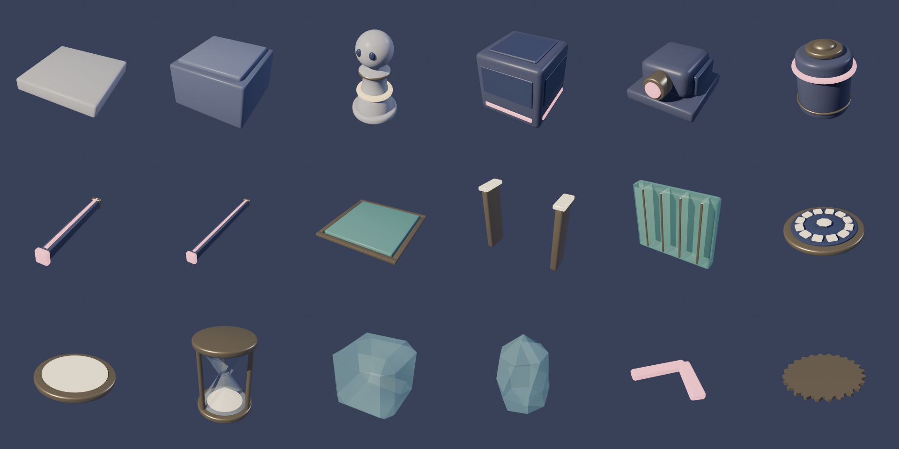

# Borrowed Seconds

**Solve compact puzzles by borrowing time from your future self.**

Freeze any moving obstacle for three seconds, but every second you borrow comes due: a few seconds later *you* freeze for three seconds, wherever you happen to be standing. While frozen, hazards pass straight through you. Thawing inside one is what kills. The best solutions turn the debt into the plan: pay it back standing on a dial, or exactly as a laser sweeps over you.

A Unity 6 (6000.6.2f1, URP) puzzle game with 20 handmade levels across four chapters. The simulation is fully deterministic, and an exhaustive solver proves every level solvable. Where a level is designed around it, the solver also proves the debt is required.



## Playing

```
Builds/Linux/BorrowedSeconds.x86_64        # or: Tools/play.sh
```

`Tools/play.sh` starts the game windowed at 1600×900 and uses Unity's native Wayland backend when a Wayland session is available. On this machine the X11/XWayland path sometimes hangs at startup.

### Controls

| Action | Keyboard + mouse | Gamepad |
|---|---|---|
| Move (one tile per step, hold to keep walking) | WASD / arrow keys | Left stick / D-pad |
| Aim at an obstacle | Hover it with the mouse, or cycle with Tab / Q / E | LB / RB |
| Borrow (freeze the aimed obstacle) | Left click or Space | A |
| Focus (time runs at 20% for precise timing) | Hold Shift or right mouse button | Hold LT |
| Rewind | Hold Z or Backspace | Hold X |
| Restart level | R | Y |
| Pause | Esc / P | Start |

Menus work with the keyboard, mouse or gamepad.

### Rules

- The world runs on a fixed 20 Hz tick. A step takes 0.15 s.
- **Borrow:** the aimed obstacle freezes for **3.0 s**. A frozen obstacle is a solid crystal: it blocks you, blocks sliders and stops laser beams. It also still weighs on plates and dials.
- **Debt:** when the loan is taken, the **term** starts counting (5 s on most levels, between 3 and 8 s on others; the table below lists the exceptions). When it runs out you freeze for **3.0 s**. The pocket watch at the bottom of the screen shows the countdown, and the ghost preview shows where every hazard will be when you freeze and when you thaw.
- While you are frozen, nothing can hurt you: sliders, laser beams and rotor arms pass through. If a hazard occupies your tile on the tick you thaw, you are *Defaulted* and the level rewinds.
- One loan at a time. Some levels also cap the total number of loans (shown as pips under the watch).
- **Obstacles:**
  - **Sliders** shuttle along a track and bounce off anything solid.
  - **Lasers** blink on a cycle and flicker before firing. A laser frozen while lit leaves a crystal bar that works as a wall.
  - **Rotors** turn their arms in quarter steps. A frozen rotor arm is a wall and stops beams.
- **Devices:**
  - **Plates** hold the gate of their colour open while anything rests on them.
  - **Gold dials** latch after 3 s of continuous weight (yours, frozen or not, or a frozen block's).
  - The **exit** opens once every dial is latched.
- **Medals:** finishing gives Bronze, finishing within par + 4 s gives Silver, and finishing within par + 1 s gives Gold ("Time Thief"). Par is the solver's optimal time.

## Content

| # | Name | Obstacles | Proven |
|---|---|---|---|
| 1-1 | First Loan | slider | B |
| 1-2 | Pass-Through | slider | B, D |
| 1-3 | Grace Period | 2 sliders (3 s term) | B, needs ≥ 2 loans |
| 1-4 | Collateral | 2 sliders, 2 dials | B |
| 1-5 | Exactly Now | 2 sliders, dial (6 s term) | B, D |
| 2-1 | Blink | 4 lasers | B |
| 2-2 | Counterweight | slider, laser, plate + gate | B |
| 2-3 | Eclipse | slider, laser | B |
| 2-4 | Crossfire | 2 lasers, dial | B, D |
| 2-5 | Fine Print | slider, laser, plate + gate, dial (3 s term) | B, D |
| 3-1 | Turnstile | rotor | B |
| 3-2 | Clockwork | 2 rotors, dial | B, D |
| 3-3 | Second Hand | 2 rotors, dial (6 s term) | B, D |
| 3-4 | Gnomon | rotor, laser | B |
| 3-5 | Escapement | 2 rotors, 2 lasers, dial (7 s term) | B, D |
| 4-1 | Double Entry | slider, laser, 2 dials | B, D |
| 4-2 | Refinance | 3 lasers (3 s term) | B, needs ≥ 3 loans |
| 4-3 | Crystal Bar | 2 lasers | B |
| 4-4 | Long Term | 2 sliders, laser, dial (8 s term) | B, D |
| 4-5 | Settlement | 2 sliders, 2 lasers, 2 dials | B, D |

*B* means the level is unsolvable without borrowing. *D* means the debt is a tool: the level is unsolvable even with unlimited debt-free loans, so your own freeze has to be part of the solution. Every level has a timing safety margin of at least ±3 ticks (150 ms). All but 2-4 have ±4.

The game also includes:
- **Title screen** with a live attract-mode replay behind the menu.
- **Level select** ("The Ledger") showing medals and best times; each level unlocks when the previous one is cleared.
- **Chapter cards**, pause menu, level-complete screen with a medal stamp, and an ending with your total time against par plus credits.
- **Settings:** master/music/effects volume, fullscreen, screen shake, reduced flashing and Focus strength.
- **Saves:** progress and settings are stored in PlayerPrefs (`bs.save.v1`).
- **Onboarding:** key-cap prompts float in the world over the thing they refer to ("WASD move" over the pawn, "Hover + click, freeze it" over the nearest slider, "Hold Shift, slow time to aim", "Hold Z, rewind further" after a default). Each retires for good once you've done it (saved). Each level also has a one-line tip about its new idea, and level 1 is built so that the only thing to try is the slider.
- **Interface:** every panel is drawn by one procedural shader (`BS/UIPanel`): chamfered watch-case corners, a lit brass rim, an enamel gradient, an outer glow, a sheen sweep and a clock-hand reveal. Screen changes use a clock-face wipe (`BS/UIWipe`). Menus blur and darken the board behind them. Motion is driven by springs and staggered easing, with per-letter text effects (drop, stamp, rise, spread, typewriter). A 3D pocket watch modelled in Blender and rendered live into the UI is the title emblem, the HUD's loan dial (its second hand counts the term down and frosts over while frozen) and the ending's centrepiece. The medal coins and padlock are Blender renders. Key hints are drawn as keycaps, and the mouse cursors are custom.
- **Time distortion:** a custom full-screen pass (`BS/TimeRipple`) sends a radial ripple with a chromatic split out from whatever you freeze and from you when a debt lands, and smears the image while rewinding. It's layered on URP's bloom, vignette, colour grading, chromatic aberration and lens distortion.

## Project layout

```
Assets/
  Scripts/Sim/      Pure C# simulation (no UnityEngine): LevelDef + JSON, SimState, Simulation.Step,
                    Solver (BFS). Integer-only and deterministic; shared by the game and the solver.
  Scripts/Game/     GameRoot (flow state machine, sim event → FX/audio), LevelSession (20 Hz loop,
                    focus, rewind history), InputReader, SaveData, LevelCatalog, Clock.
                    GameRoot.Demo (scripted demo reel), GameRoot.InputBot (controls smoke test, fps probe).
  Scripts/View/     BoardView, Pieces (per-obstacle views), GhostPreview, CameraRig, Fx,
                    WorldEnvironment (backdrop, gears, post-processing pulses), Mats, Shapes.
  Scripts/UI/       Runtime-built uGUI + TextMeshPro: Hud, Prompts (in-world onboarding), Menus (title,
                    level select, pause, settings, complete, chapter card, ending), Kit (panels, sliders,
                    toggles, keycaps, coins), Motion (springs, easing), TextFx (per-letter animation),
                    WatchStage (3D watch rendered to a texture), Transition (clock wipe), Cursors.
  Scripts/Audio/    AudioDirector: pooled SFX with low-pass "muffle", crossfading music decks.
  Shaders/          Backdrop, Crystal, Ghost, Glow (beams), Ring (watch), Particle, TimeRipple (full screen,
                    also the menu blur), UIPanel and UIWipe (interface).
  Resources/        Levels/levels.json + solutions.json, Models/*.fbx, Audio/*.wav, Fonts, Materials.
  Editor/           ProjectSetup (URP assets, renderer features, materials, scene), BuildScript, import settings.
  Tests/Editor/     EditMode tests: every solver replay wins at par under Unity's Mono runtime.
ArtSource/          build_assets.py and build_ui_assets.py (Blender bpy generators), generated .blend files, previews/.
Tools/
  unity.sh          Run the editor / a batch method / the Linux build.
  play.sh           Run the built game (add `dev` for the development build).
  validate.sh       Build and run the solver over every level and write solutions.json.
  capture.sh        Self-test: the built game autoplays every level from the solver's replays.
  devcap.sh         Development build followed by capture.sh.
  inputbot.sh       Controls smoke test: plays 1-1 through virtual keyboard and mouse devices.
  demo/             record.sh + mix.py: records the demo reel to Builds/Demo/.
  Solver/           .NET 8 console front end for the shared simulation and solver.
  lab/              Per-level design files (cXY.json), lab.py (solve one), assemble.py.
  audio/            synth.py: every sound effect and music loop, synthesised with numpy.
docs/               BRIEF.md (the assignment) and PLAN.md (design and technical plan).
```

Everything apart from the camera, light and volume in `Assets/Scenes/Main.unity` is built at runtime from data.

## Rebuilding

All commands are run from the project root.

| What | Command | Notes |
|---|---|---|
| 3D models | `blender -b --factory-startup -P ArtSource/build_assets.py` | Writes `Assets/Resources/Models/*.fbx`, `ArtSource/*.blend` and the preview renders. |
| UI models | `blender -b --factory-startup -P ArtSource/build_ui_assets.py` (or `-- watch`, `coins` or `lock`) | Writes `Assets/Resources/Models/PocketWatch.fbx` and renders the medal coins and padlock to `Assets/Resources/UI/`. |
| Audio | `Tools/audio/synth.sh` (or `sfx`, `music`, or a single name like `music_a`) | Runs `synth.py` with Blender's bundled Python, because it needs numpy. Writes `Assets/Resources/Audio/*.wav`. Takes about 2 minutes. |
| Levels | Edit `Tools/lab/cXY.json`, check it with `python3 Tools/lab/lab.py Tools/lab/c15.json`, then run `python3 Tools/lab/assemble.py` | Writes `levels.json`. |
| Proofs and replays | `Tools/validate.sh` (or `--level 4-5`, or `--quick`) | Proves B/D and margins and writes `solutions.json`. 4-5 is the slow one: it searches up to 150M states and needs a lot of RAM. |
| Materials / scene | `Tools/unity.sh batch BorrowedSeconds.EditorTools.ProjectSetup.Apply` | |
| Linux build | `Tools/unity.sh build-linux` | Writes `Builds/Linux/BorrowedSeconds.x86_64`. |
| Self-test | `Tools/devcap.sh /tmp/bs-cap` | Development build, then autoplays all 20 levels and prints PASS/FAIL per level, saving screenshots. |
| Unity tests | `unity test . --mode EditMode` | 42 EditMode tests: each saved solution replayed under Mono must win at exactly its par tick; idling never wins; state keys round-trip. |
| Controls test | `Tools/inputbot.sh` | Release build plays 1-1 through virtual keyboard + mouse: taps, a held key, Shift-focus aiming, hover and click-to-borrow, repayment, win. |
| Frame rate | `Tools/play.sh -bsFps /tmp/fps.txt -bsNoVsync` | Plays the three busiest levels and logs average fps and worst-1% frame time. |
| Demo reel | `Tools/demo/record.sh` | Needs the Linux build. Records a 1:45 reel frame-locked at 60 fps to `Builds/Demo/BorrowedSeconds_demo.mp4` and mixes its soundtrack offline from the game's audio event log. |

## Status

What has been verified:
- The latest build autoplays all 20 levels from the solver's saved replays, and every one passes (`Tools/capture.sh`). This checks that the in-game loop matches the solver tick for tick.
- The solver proves every level solvable and proves each B/D claim in the table above.
- A scripted menu tour (`Tools/play.sh dev -bsMenus DIR`) captures frame-locked bursts at 30 fps of every screen's intro animation. It covers the title, level select, chapter card, play, pause, settings, level complete and ending screens with no console errors.
- 42 EditMode tests pass in Unity, so the .NET 8 solver and the game's Mono runtime agree tick for tick.
- The input bot wins 1-1 through the real input path (3 of 3 runs) using virtual keyboard and mouse devices.
- Frame rate on this machine (AMD Radeon 8060S iGPU, 1600×900, vsync off): 316–428 fps average and 6.5–7.9 ms worst-1% frame time on 4-5, 3-5 and 2-4. With vsync on, a window that isn't visible is throttled by the Wayland compositor (to about 11 fps here); that's the compositor, not the game.

Known gaps and differences from `docs/PLAN.md`, stated plainly:
- **Audio is unheard.** It is fully procedural and checked only numerically and with spectrograms (levels, clipping, loop seams); nobody has listened to it on speakers during development. The mix balance between SFX and music may need tuning.
- **No human playtesting.** Difficulty and the margins come from the solver, not from people.
- **Levels were reworked against the solver**, so names and order differ from the plan's original draft (*Hold Still*, *Out of Phase* and *Leverage* became *Crossfire*, *Second Hand* and *Gnomon*). `docs/PLAN.md` §6 now lists the levels as shipped.
- **The finale (4-5) has no rotors**, so it doesn't combine all three obstacle types as planned. Rotors are combined with lasers in 3-4 and 3-5.
- **Linux only.** Only the Linux standalone was built and tested.

## Credits

Design, code, models (Blender bpy) and audio (numpy synthesis) were all generated for this project. The font is Fira Sans (SIL Open Font License, `Assets/Resources/Fonts/OFL-FiraSans.txt`). Built with Unity 6 URP and Blender 4.5.
